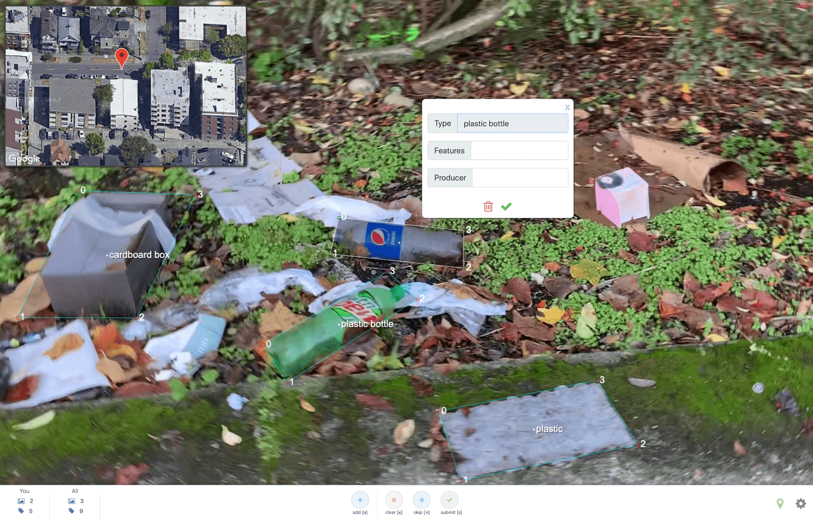

**recyclr** serves images from a server and provides a labeling interface for crowdsourcing detection.
  

## Instructions
**Setup configuration** - configs are found in sentinel.py (let's move this to config.json yo)

    # number of independent labelings of an image to consider it labeled
    self.label_threshold = 5

	# max number of unlabeled images to keep available for labeling
    self.max_unlabeled_imgs = 30

	# rate (in sec.) to check and remove already-processed videos
    self.video_cleanup_rate = 20

	# rate (in sec.) to check and move fully labeled frames
    self.frame_cleanup_rate = 10

	# rate (in sec.) to convert videos into individual frames for labeling
    self.process_video_rate = 5

	# rate (in sec.) to recalculate statistics
    self.update_stats_rate = 5

**Standing up the server:**

    virtualenv recyclr
    source recyclr/venv/bin/activate
    (venv) user@local $ ./setup.sh
    python server.py

**Adding data to be labeled**
Simply place your raw videos in the **server/data/raw** directory. These videos will be selected when necessary and converted into individual frames to be served for labeling.
